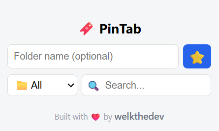
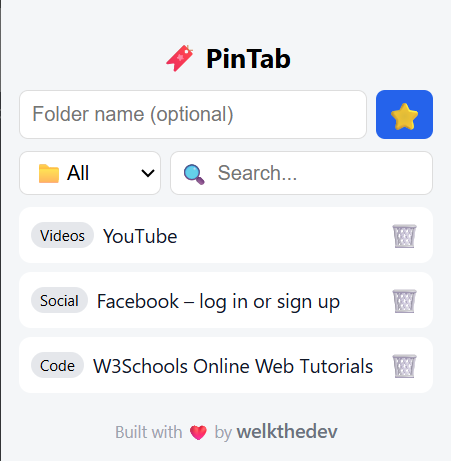

# 🔖 PinTab – Save & Organize Links

  
*A modern Chrome extension to save, organize, and search your favorite websites instantly.*

---

## 🌟 Overview

**PinTab** is a lightweight, **folder-based Chrome extension** designed to help you:

- Save websites with a single click ⭐  
- Organize links into **folders / categories** 📁  
- Search through saved websites 🔍  
- Delete entries you no longer need 🗑️  
- Store data **locally and persistently** using `chrome.storage.local` 💾  

Perfect for **developers, students, and professionals** who want a clean, organized browsing experience.

---

## 🚀 Features

| Feature | Status |
|---------|--------|
| Save current tab | ✅ |
| Folder / Category support | ✅ |
| Search saved websites | ✅ |
| Delete websites | ✅ |
| Persistent local storage (`chrome.storage.local`) | ✅ |
| Icon-based modern UI | ✅ |
| Footer branding | ✅ |
| Offline usage | ✅ |

---

## 📸 Screenshots

1️⃣ **Main UI with folders**
-----------------------------


2️⃣ **Saving a new website**
-----------------------------



---

💾 **Download & Install (No GitHub Needed)**

You can use PinTab without GitHub by downloading the ZIP file:

1️⃣ **Download the ZIP**

Download the latest version of PinTab:
Download PinTab.zip

(Replace this link with your hosted ZIP, e.g., Google Drive, Dropbox, or any file host.)

2️⃣ **Extract the ZIP**

Right-click the downloaded PinTab.zip → Extract Here or Extract to PinTab folder
You should now have a folder like this:

```PinTab/
├── manifest.json
├── popup.html
├── popup.css
├── popup.js
└── ss/
```

3️⃣ Load into Chrome

Open Chrome and go to: `chrome://extensions/`
- Enable Developer Mode (top-right toggle)
- Click Load unpacked
- Select the extracted PinTab folder
- The PinTab icon will appear next to the address bar, ready to use ✅

4️⃣ **Start Saving Websites**

- Open any website
- Click the PinTab icon
- Enter a folder name (optional)
- Click ⭐ to save
- Use search & folder filter to find saved sites 🔍
- Delete websites with 🗑️ if needed

---

## 🛠️ Built With

- **HTML, CSS, JavaScript**  
- **Chrome Extensions API** (`tabs` & `storage`)  
- Icon-based, responsive UI  
- `chrome.storage.local` for **persistent local storage**

---

## 📂 Data Structure

Each saved website is stored as a JSON object:

```json
{
  "title": "Google",
  "url": "https://google.com",
  "folder": "Work",
  "savedAt": 1700000000000
}
```

- Stored in `chrome.storage.local`  
- Maximum storage: ~10MB (~30,000–50,000 websites)  
- Fully private and offline

---

## ⚡ Future Improvements

- Cloud sync for multi-device access (Firebase / Supabase) ☁️  
- Export / import saved websites (CSV / JSON) 📤  
- Dark mode toggle 🌙  
- Drag & drop folder reordering 🖱️  
- Publish to Chrome Web Store 🏪  

---

## 👤 Author

Built with ❤️ by [welkthedev](https://github.com/welkthedev)

---

## 📄 License

MIT License © 2026 welkthedev

---

## 💡 Tips for Users

- Use **folders** to keep work, study, and personal links separate  
- Search is **case-insensitive** and works on both **title & URL**  
- Deleting a website is **permanent**, so double-check before clicking 🗑️ 
